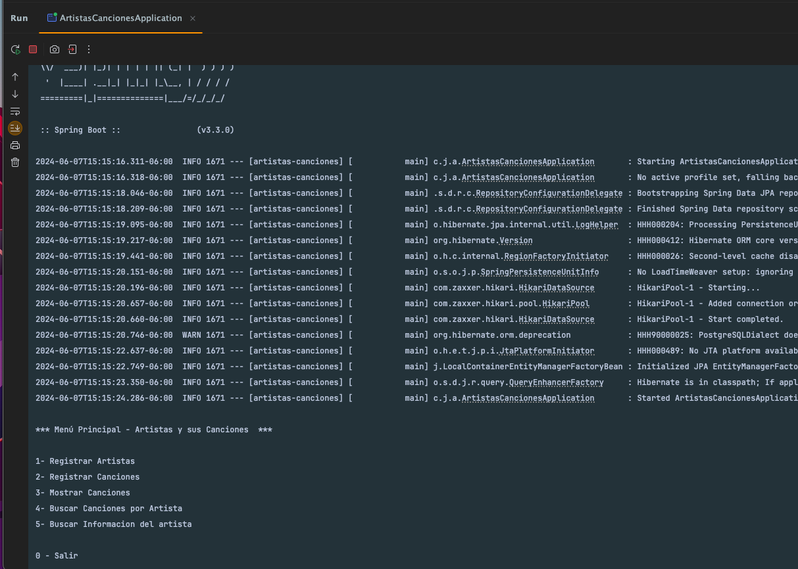
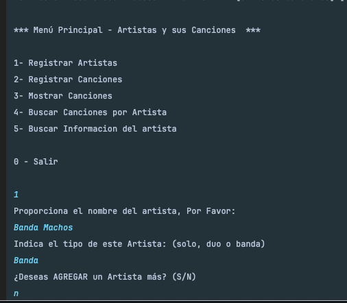
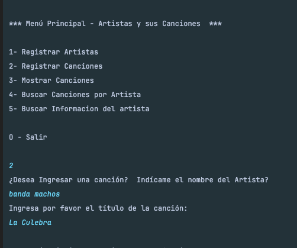
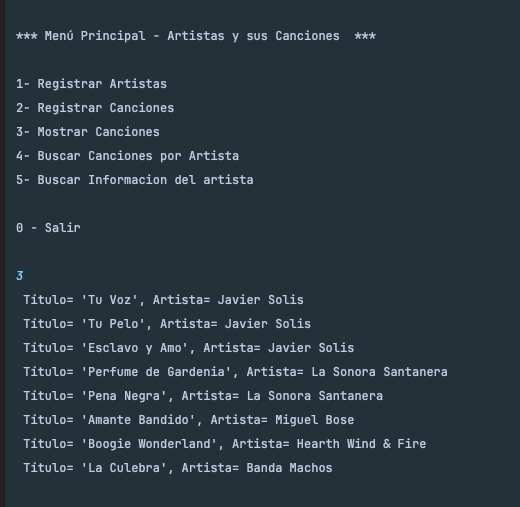
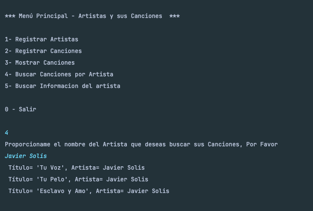
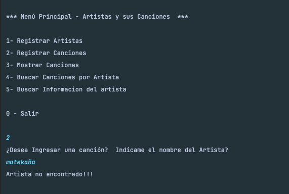
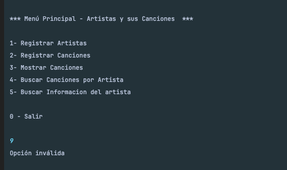
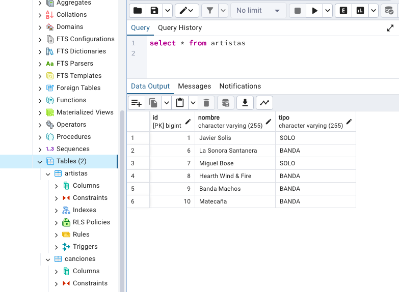
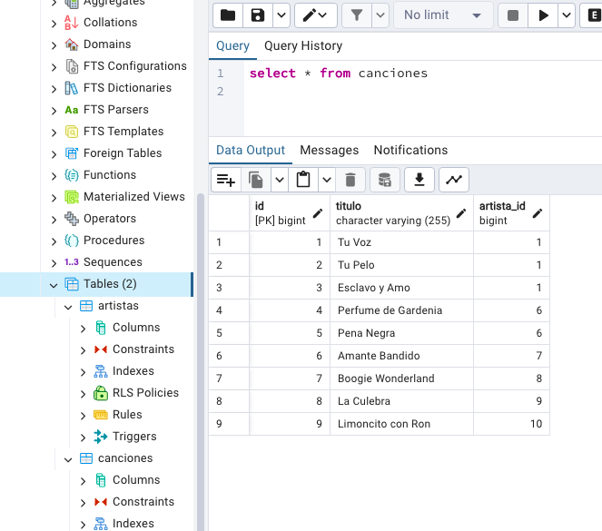

# Artistas y Canciones - Java - SpringBoot

## Descripción

Este proyecto permite al usuario agregar Artitas y canciones, asociadas a cada Artista, así mismo es posible  realizar consulta de las canciones en general y por artista. 

El sistema:
- Muestra un menú Principal para el Alta y consulta de Artistas y Canciones 
- Guarda los valores en una base de Datos Postgres de manera Local.
- Realiza la consulta de Artistas y Canciones almacenados en la base de datos .
- Dicha información va siendo creada por el usuario según se van ingresando Artistas y Canciones

## Tecnologías Utilizadas

- Mac Os 
- Intellij IDEA ver. 2024.1.1 
- JDK de Java 21.0.2 
- Postgres 
- Spring 
- Hibernate 

## Demostración del Sistema

Menú de inicio al sistema.

Agregar Artista.

Agregar Canciones

Consulta Canciones

Consulta Canciones por Artista.

Artista NO encontrado

Opción de Menú no valida

Base de Datos - Tabla Artistas

Base de Datos - Tabla Canciones

## Estado del Proyecto

El proyecto se encuentra en su versión 1.0.0.

## Acceso al Proyecto

Puedes acceder al proyecto y obtener el código fuente desde su repositorio en [GitHub Artistas y Canciones](https://github.com/MAValerdi/Conversor-monedas-java).

## Instrucciones de Uso

1. Clona el repositorio desde GitHub.
2. Asegurate que el proyecto este en alguna ubicación en tu equipo local.
3. Importa el proyecto desde tu IDE Intellij IDEA o el IDE de tu preferencia.
4. Ejecuta la aplicación y sigue las instrucciones en pantalla.
5. Asegurate de crear las variables de entorno adecuadas.
6. Asegurate de tener instalado la última version de la base de datos Postgres.
7. 

## Autor
Mario Alberto Valerdi Garduño
[Linkedin Mario Valerdi](https://www.linkedin.com/in/mariovalerdi).

#### Anotaciones finales:
Challenge Adicional al curso "JAVA - PERSISTENCIA DE DATOS CON SPRING".
Del curso 'Java: persistencia de datos y consultas con Spring Data JPA'
de ALURA Latam, Oracle ONE G6
